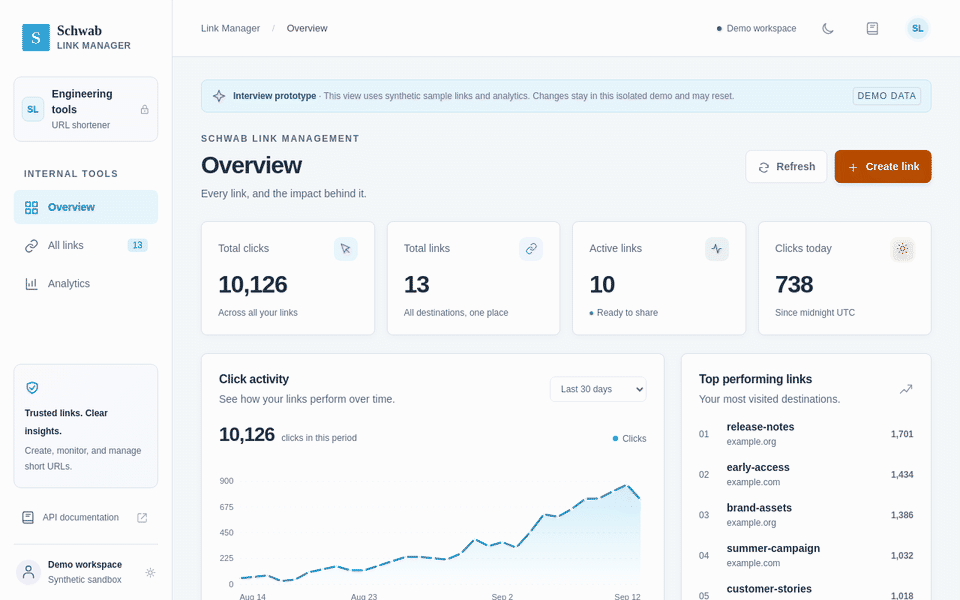
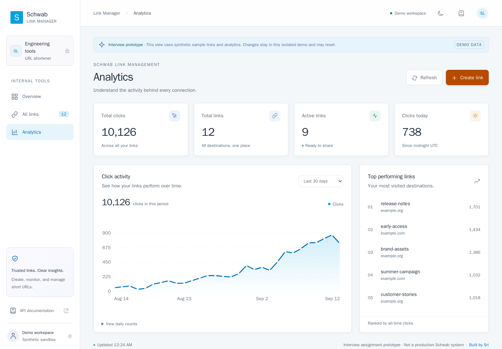
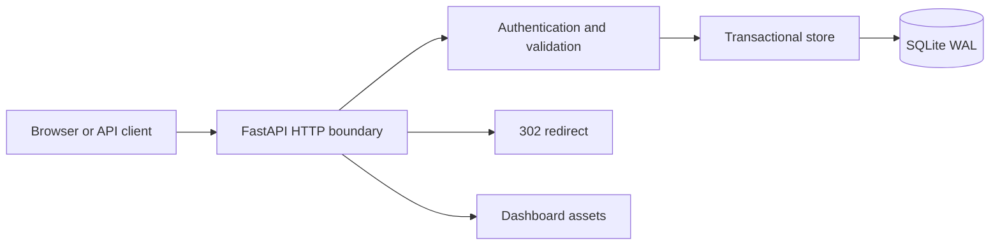

# Schwab Link Manager

A production-oriented URL shortener prototype with a FastAPI backend, SQLite persistence, redirect analytics, reliability controls, and a responsive management dashboard.

No hosted environment is published with this submission. The service runs locally in four
commands ([Run the dashboard](#run-the-dashboard)) and serves the interface below. Scenario 4 in
[docs/engineering-execution.md](docs/engineering-execution.md) records why the hosted demo was
withdrawn rather than shipped in a known-broken state.



<details>
<summary>Analytics view</summary>



</details>

## What is included

- Create generated or custom short links.
- Resolve links with `302` redirects.
- Track lifetime and UTC daily click counts.
- Search, filter, paginate, inspect, and disable links.
- Enforce expiration and permanent alias reservation.
- Support retry-safe creation with idempotency keys.
- Provide health, readiness, OpenAPI, and structured error responses.
- Run a responsive dashboard with chart tooltips and light/dark themes.

## Architecture



The application separates HTTP concerns, typed contracts, persistence, and UI assets:

- `app/main.py`: routes, authentication, request limits, errors, headers, and composition.
- `app/models.py`: request and response contracts and URL validation.
- `app/store.py`: SQL transactions, idempotency, link state, and analytics.
- `app/schema.sql` and `app/migration_002.sql`: versioned database schema.
- `app/static/`: framework-free dashboard.
- `server.py`: Vercel interview-demo entry point.

The dashboard exists so the prototype is reviewable end to end without an API client. The engineering claims in this repository are made about the service, its contracts, and its transactions; the interface consumes those APIs and holds no behavior of its own.

See [Architecture and decisions](docs/architecture.md) for transaction semantics, scaling decisions, and failure behavior.

## Run the dashboard

Requires Python 3.12.

```bash
python3.12 -m venv .venv
source .venv/bin/activate
python -m pip install -r requirements-dev.lock
python -m pip install --no-deps -e .
python scripts/run_dashboard.py
```

Open http://127.0.0.1:8000/. The demo launcher creates an isolated temporary database containing clearly labeled synthetic data.

## Run the persistent service

```bash
export SHORTENER_API_KEY="$(python -c 'import secrets; print(secrets.token_urlsafe(32))')"
export SHORTENER_BASE_URL=http://127.0.0.1:8000
export SHORTENER_DATABASE=shortener.db
python -m uvicorn app.main:create_app \
  --factory \
  --host 127.0.0.1 \
  --port 8000 \
  --workers 1 \
  --no-access-log
```

The API key remains in the process environment. Startup rejects missing or short credentials. The prototype should run with one worker because SQLite and the creation limiter are process-local.

## Deploy as a container

Nothing is hosted for this submission, but the deployment path is defined and verified locally.
SQLite needs one writer on one disk, so the service must run as a single instance bound to a
single volume; a scale-out serverless platform gives each instance its own database, and links
created on one instance are missing from the others. The image runs anywhere a container can
mount a disk, under that constraint.

The image defaults to the API-key protected service. Override the command to run the seeded,
unauthenticated demo:

```bash
docker build -t schwab-link-manager .
docker run --rm -p 8000:8000 \
  -v shortener_data:/data \
  -e SHORTENER_BASE_URL=http://127.0.0.1:8000 \
  schwab-link-manager \
  python -m uvicorn server:app --host 0.0.0.0 --port 8000 --workers 1 --no-access-log
```

## API

| Endpoint | Access | Behavior |
|---|---|---|
| `POST /api/v1/links` | Bearer | Create a link; supports `Idempotency-Key` |
| `GET /{code}` | Public | Count an eligible request and return `302` |
| `HEAD /{code}` | Public | Check eligibility without counting |
| `GET /api/v1/links` | Bearer | Search, status filter, and paginate |
| `GET /api/v1/links/{code}` | Bearer | Return link metadata |
| `GET /api/v1/links/{code}/analytics` | Bearer | Return lifetime and daily counts |
| `GET /api/v1/dashboard` | Bearer | Return dashboard aggregates and top links |
| `DELETE /api/v1/links/{code}` | Bearer | Idempotently disable a link |
| `GET /health` | Public | Liveness |
| `GET /ready` | Public | Schema readability |

Interactive API documentation is available at `/docs`. The versioned machine-readable contract is [docs/openapi.json](docs/openapi.json).

## Verification

```bash
ruff check app tests scripts server.py
ruff format --check app tests scripts server.py
bandit -r app server.py -q
pytest --cov-fail-under=95
python scripts/export_openapi.py --check
python scripts/verify_http.py
pip-audit -r requirements.lock
npm ci
npm run format:check
npm test
```

The validated suite contains 82 Python tests and 12 JavaScript/DOM tests with 98.99% combined Python statement/branch coverage. Tests cover validation, authentication, redirects, expiration boundaries, disable behavior, concurrency, transaction rollback, migrations, idempotency, analytics, backup/restore, UI behavior, and log privacy.

GitHub Actions executes the full quality pipeline on every push.

## Key engineering decisions

- A click is a committed eligible `GET` redirect decision. `HEAD`, missing, expired, and disabled requests are excluded.
- Eligibility and both analytics counters update in one transaction before the redirect is returned.
- Redirects use `302` with `Cache-Control: no-store` so disable and expiration decisions continue to reach the service.
- Idempotency keys are hashed and transactionally mapped to the canonical creation request.
- Destination URLs are validated but never fetched by the service.
- Logs exclude destinations, query strings, credentials, IPs, referrers, and user agents.
- Disabled aliases remain reserved to prevent an old link from being reassigned to another destination.

## Production boundaries

This is a reviewable prototype, not a production-approved system. Before public or multi-instance use, replace SQLite with durable PostgreSQL, introduce user identities and ownership authorization, add centralized rate limiting and abuse controls, define retention and SLOs, validate backups and restore objectives, and complete security and accessibility review.

The Vercel demo intentionally uses synthetic temporary SQLite state and bypasses operator authentication. It must not be connected to real data.

## AI-assisted engineering

AI assisted requirement analysis, implementation, test generation, debugging, refactoring, documentation, and review preparation. The engineer retains ownership of requirements, accepted design decisions, validation, maintainability, and release readiness.

[Engineering execution and traceability](docs/engineering-execution.md) records the required greenfield, brownfield, and ambiguous scenarios, including accepted, edited, and rejected AI proposals.

[AI execution records](docs/ai-execution.md) hold the per-task working loop: task specification, what the assistant produced, what was accepted, edited, or rejected, and the secure-usage and sign-off controls applied to assisted work.

---

Built by [Sri Ganesh Shiramshetty](https://www.srishiram.com/).
