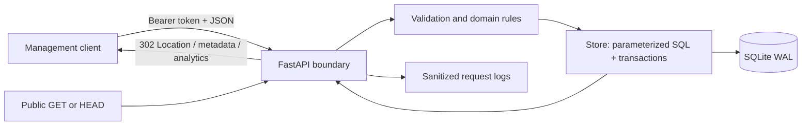

# Architecture and engineering decisions

## Components and control flow

`config.py` validates startup configuration. `models.py` owns input and output contracts. `main.py` owns HTTP, authentication, body limits, creation admission, errors, headers, and logging. `store.py` owns link state, transactions, collision retries, idempotency, and analytics. SQL files own schema evolution. This keeps transport concerns out of persistence and permits direct concurrency/failure testing of the store.

The diagram's management client and public browser both receive their respective responses; the service never requests a destination URL. The Schwab Link Manager dashboard is served at `/` with local HTML, CSS, and JavaScript assets under `/ui/assets/`. It calls the same authenticated APIs over the same origin. Swagger UI remains available at `/docs`.

### Create

Authenticate → parse bounded JSON → validate destination/alias/timezone → process-local creation budget → begin write transaction → check hashed idempotency key → validate expiry for a new request → insert unique code (up to five random collision retries) → insert replay mapping → commit → 201. A matching replay returns 200 and current metadata for the original link. Changed content under the same key returns 409.

### Resolve

GET: begin immediate transaction → select link → reject missing/inactive → increment total → upsert UTC daily count → commit → 302. The redirect is emitted only after commit. HEAD reads eligibility without writes. `Cache-Control: no-store` makes expiry/disable and counting semantics explicit; a permanent cached 301 could bypass the service.

A click is a **committed GET redirect decision**, not proof that a human followed the link. A connection can fail after commit; a client may retry; both decisions may be counted. A GET racing with disable may complete if its transaction was first. Once disable commits, subsequent GET checks return 410.

### Data model

- `links`: unique code, exact validated destination, UTC epoch timestamps, disabled flag, lifetime count.
- `daily_clicks`: composite primary key `(code, day)` and FK to links; atomic daily increment.
- `idempotency_keys`: SHA-256 key hash, canonical request hash, FK to the original code.
- `PRAGMA user_version`: v1 baseline, v2 additive idempotency migration. Unknown future versions fail startup.

SQL uses bound parameters. Codes use 6 cryptographically random bytes encoded as 8 URL-safe characters (48 bits). They are identifiers, not authorization secrets. User aliases are case-sensitive, 4–32 ASCII characters; collisions always resolve through the unique database constraint. An application-only preflight uniqueness check would race.

## Decisions and alternatives

| Decision | Rationale | Cost / alternative |
|---|---|---|
| FastAPI + Pydantic | Validation, typed contracts, generated OpenAPI, compact runnable service | Framework dependencies; pinned snapshots and audit |
| SQLite WAL | Real persistence and transactions without infrastructure setup | One writer at a time; one host/local volume; use PostgreSQL for multi-host growth |
| Atomic synchronous analytics | No lost counters or accepted redirects before counting commit | Storage write contention can fail redirects with 503 |
| Single bearer token | Small trusted-operator prototype; protects write/analytics endpoints | No tenant isolation, identities, roles, revocation list, or per-user attribution |
| Soft disable, no alias reuse | Prevent old references from pointing to a new owner's destination | Retains rows; no physical deletion or product retention schedule |
| UTC daily counts only | Meets defined analytics scope without visitor data collection | No unique-user, geography, bot filtering, or referrer metrics |
| Optional idempotency header | Safe retries across client timeout or service restart | Keys retained indefinitely; single operator namespace |
| Process-local create budget | Bounded lightweight admission: 60 requests/minute | Resets on restart; not a distributed abuse prevention system |

The application limits JSON bodies to 8 KiB, URL length to 2048 characters, alias length, and idempotency key length. A bounded byte buffer avoids storing unlimited empty ASGI frames. Slow uploads and connection floods require ingress controls.

Application logs contain generated request ID, method, route template, status, duration, and sanitized storage failure type. Uvicorn access logs are disabled in documented commands because they can include client IP and raw URLs. `/ready` tests readable schema, not write availability or backup health.

## Growth path and operating model

1. Before public use: TLS, managed secrets and rotation, trusted ingress host controls, request deadlines, centralized rate limiting, abuse reporting and takedown, destination threat screening, retention policy, human security review.
2. Before multiple instances: PostgreSQL repository implementation, explicit migration runner, shared admission controls, real auth identities with ownership predicates, deployment health and backup/restore drills.

The PostgreSQL step is costed rather than asserted. `app/store.py` is the only module that issues
SQL, so the change surface is one file plus configuration: `instr(lower(col), lower(?))` search
becomes `ILIKE`, `PRAGMA user_version` versioning becomes a migrations table read in the same
transaction, `BEGIN IMMEDIATE` becomes an explicit isolation level with retry on serialization
failure, and `INSERT ... ON CONFLICT DO UPDATE` carries over unchanged. The route layer, the
Pydantic contracts, the OpenAPI document, and the behavioural tests are dialect-independent and
are expected to transfer without edits; the store tests that assert SQLite locking behaviour are
the exception and would be replaced. Connection-per-request would become a pool, and the
process-local creation limiter would move to a shared store, since it stops being correct the
moment a second instance exists.
3. For higher redirect volume: define allowed analytics loss/lag before using a queue. Caching requires a reviewed invalidation design for disable/expiry; do not simply add permanent redirects or cache stale eligibility.
4. Define a workload and SLO, run sustained load and failure tests, monitor 503/429 rates and latency, disk usage, and backup age. The local burst is not an SLO.

SQLite WAL permits overlapping readers and writers but still serializes writes; use local storage rather than a shared network filesystem. See [SQLite WAL documentation](https://www.sqlite.org/wal.html). Lifecycle initialization follows [FastAPI lifespan guidance](https://fastapi.tiangolo.com/advanced/events/).

## Dashboard extension

The frontend adds no runtime dependency or separate server. `dashboard-core.mjs` contains testable date, status, payload, pagination, and chart calculations. `dashboard.js` owns DOM updates and API interactions; untrusted URLs/codes are inserted with `textContent`, not HTML parsing. Native dialogs handle modal focus and dismissal. Data tables provide a non-chart representation of daily counts.

Listing and summary queries each use one database read snapshot. List page size is capped at 100, search at 200 characters, and chart range at 90 days. All values are bound SQL parameters. Static assets use `/ui/assets/` so an existing `assets` shortcode is not shadowed. The HTML and assets receive a same-origin CSP with framing blocked.

The separate `run_dashboard.py` launcher creates a temporary synthetic database and explicitly enables demo mode with no authentication, binding to 127.0.0.1. The normal environment configuration cannot enable this mode. `server.py` exposes the same explicit demo on a host, reading `SHORTENER_DATABASE` and `SHORTENER_BASE_URL` and falling back to a temporary directory. Same-origin requests are accepted across host aliases; foreign Origin headers are rejected. The database path must be durable and shared by every request: a serverless temporary directory is private to one instance, so a link created on one instance returns 404 from the others and the dashboard shows a link it cannot then read. The demo therefore requires single-instance execution: the local launcher, or a single container on a mounted disk. This hosted mode remains a review convenience and not a replacement for regular authentication.
